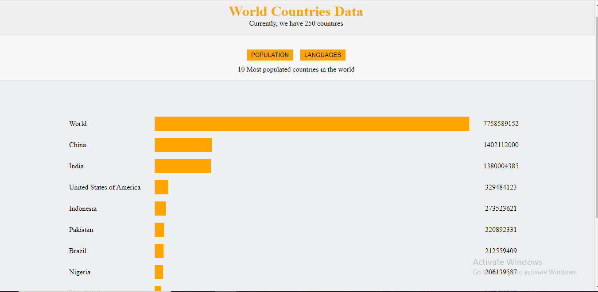

#  asabeneh-world-countries-data-visulisation1
*An implementation of asabeneh-world-countries-data-visulisation1 clone with html, css and JavaScript*
## Prequisite
- Your browser version should be up to date for better experience
## Features
- Home page
## Tech/framework used
- Html
- Css
- JavaScript
## Preview here
[Go Live](https://willowy-chebakia-5f3631.netlify.app)

## Contact
If you want to contact me you can reach me at
- https://github.com/Intelligence247 or
- uthmanabdullahi2020@gmail.com
## Addtional Info
- This is one of the series of project for the @CodeVillage.org
- This is not meant for production. It's for learning purpose only
